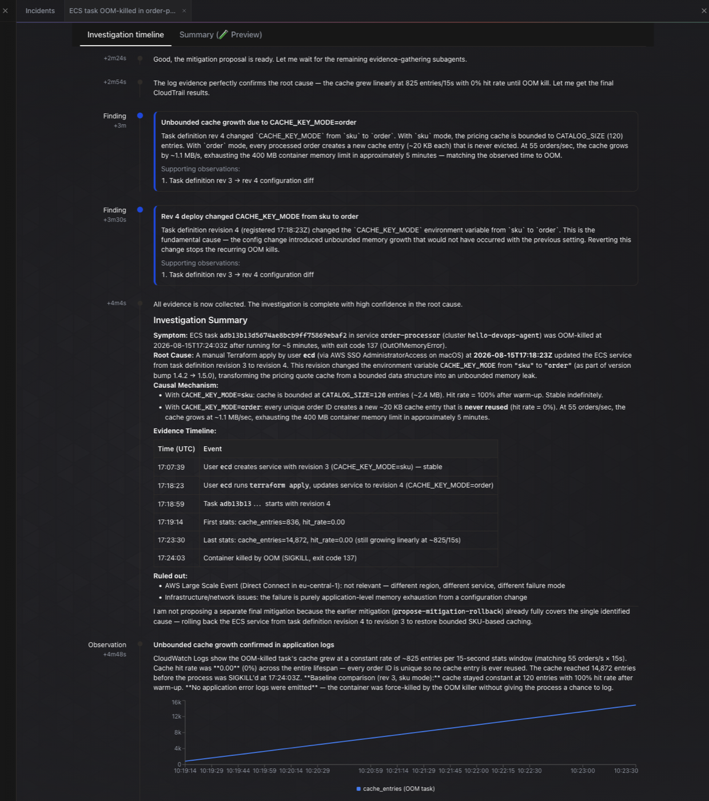

# hello-devops-agent

A deliberately broken ECS Fargate service, wired to AWS DevOps Agent, so you can
watch a real investigation happen end to end.

The workload is a mock order processor with a memoized pricing engine. A config
change repoints its quote cache from the product SKU to the order id. Order ids
are unique, so the cache stops hitting and starts growing without bound, and
Fargate OOM-kills the container a few minutes into every task.

**Nothing in the container names the fault.** There is no `LEAK` variable, no
comment flagging the bug, no log line mentioning memory. The application source
is embedded in the task definition, so the agent can read all of it — and the
code looks like ordinary caching code, because it is. The only difference between
the healthy and broken revisions is one string:

```diff
- CACHE_KEY_MODE=sku      # bounded by the 120-SKU catalog, ~100% hit rate
+ CACHE_KEY_MODE=order    # unbounded: every order id is unique
```

That is the point of the exercise. Pointing an agent at something obviously
broken proves nothing. Reaching the root cause here means chaining several steps:
notice memory grows linearly and resets on restart, find the task definition diff,
read the caching code, work out that order ids have unbounded cardinality, and
corroborate against a cache hit rate that fell from 1.00 to 0.00 while the entry
count climbed with traffic.

## What it produces



That is an unedited run against this repo. Working from an ECS stop event, the
agent reached the causal mechanism on its own:

> With `sku` mode, the pricing cache is bounded to `CATALOG_SIZE` (120) entries.
> With `order` mode, every processed order creates a new cache entry (~20 KB
> each) that is never evicted. At 55 orders/sec, the cache grows by ~1.1 MB/s,
> exhausting the 400 MB container memory limit in approximately 5 minutes —
> matching the observed time to OOM.

Note what that required. Nothing told it order ids are unique; it inferred that
the cardinality of the key is what changed, then derived a growth rate from the
entry size and order rate and checked it against the observed time to death. It
also recovered the deploying user and the exact `terraform apply` from CloudTrail,
plotted `cache_entries` from log lines, ruled out an unrelated concurrent AWS
event, and recommended reverting the key rather than raising the limit.

Elapsed: about 4 minutes from incident to summary.

## Architecture

```
 cache_key_mode=order                                           DevOps Agent
        │                                                             │
        ▼                          EventBridge                        │
  task def rev 2  ──► ECS service ──► task stopped ──► bridge ───────►│ webhook
  CACHE_KEY_MODE=order    │           stopCode=          Lambda       │ (HMAC)
  APP_VERSION=1.5.0       │           EssentialContainerExited        │
                          ▼           exit 137                        ▼
                    OOM kill ─────────┘                         investigation
                          │                                           │
                          ▼                                  reads metrics, logs,
                    scheduler restarts                       CloudTrail, task defs
                          │                                     on its own
                          ▼                                           ▼
                     crash loop                              root cause + fix
```

One trigger is enough. DevOps Agent has no native EventBridge target, so a small
Lambda translates the ECS event into the webhook's incident schema and HMAC-signs
it.

**Push to start, pull to investigate.** The agent does not poll your metrics
looking for anomalies. Nothing happens until something pushes to it. But once
triggered it queries CloudWatch metrics, logs, CloudTrail and task definitions
itself with its read-only role — on the recorded run it identified the deploying
user, the Terraform version and the source IP from CloudTrail, none of which the
incident payload contained. It does not need an alarm to notice memory pressure.

There are three ways in, and only the first needs the Lambda in this repo:

| Entry point | How |
|---|---|
| Generic webhook | HMAC-signed POST from anything. Needed here because CloudWatch and EventBridge have no native connector |
| Native integrations | PagerDuty, ServiceNow, Datadog, Dynatrace, GitHub, GitLab, Slack. Their association config carries `enable_webhook_updates`, letting the agent register itself with that service so it pushes directly. No bridge |
| Schedule triggers | `create-trigger` accepts exactly one condition type, `schedule={expression=...}`. This is the proactive evaluation path, not incident response |

Plus human-initiated chat from the web app.

That distinction matters for how much plumbing you build. A `MemoryUtilization`
alarm is available behind `enable_memory_alarm`, but it is **off by default** and
the demo does not use it: the ECS stop event already carries exit code 137 and
`OutOfMemoryError`, which is everything the agent needs to start. The alarm only
buys an earlier start, and for OOM the crash follows ~90 seconds later anyway.

If you do turn it on, mind the denominator — see `memory_alarm_threshold`.
`AWS/ECS MemoryUtilization` is measured against *task* memory (512 MiB) while the
container dies at its own 400 MiB limit, so utilization tops out near 78% and an
observed run peaked at 69%. An 80% threshold never fires.

## What gets created

33 resources in one root module:

| File | Contents |
|---|---|
| `agent.tf` | Agent space, operator app role, agent space role, AWS account association |
| `network.tf` | VPC, two public subnets, IGW, egress-only security group |
| `ecs.tf` | Cluster, log group, task definition, Fargate service |
| `detection.tf` | EventBridge rule, bridge Lambda, webhook secret, optional memory alarm |
| `scripts/setup-webhook.sh` | Creates the event channel and captures its credentials |
| `app/order_processor.py` | The mock service. Runs from a public Python image — no build, no ECR |
| `lambda/incident_bridge.py` | EventBridge → webhook translation and signing. Stdlib only |
| `skills/ecs-fargate-oom/SKILL.md` | An investigation skill to load in phase 5 |

Notes on a few choices:

- **Public subnets with public IPs on the tasks.** Avoids a NAT gateway (~$32/mo)
  for a demo whose only egress need is pulling an image.
- **Container hard limit (400 MiB) below the task limit (512 MiB).** Guarantees a
  container-level OOM kill, which yields `stopCode: EssentialContainerExited` and
  exit code 137 rather than an ambiguous platform failure.
- **Deployment circuit breaker off.** With rollback enabled, ECS would heal the bad
  deployment itself and the crash loop would vanish before you could investigate it.
- **`awscc` provider for the agent space.** The `aws` provider has no DevOps Agent
  resources yet — only the older, unrelated DevOps Guru.

## Prerequisites

- Terraform >= 1.5, AWS credentials with admin in a
  [supported region](https://docs.aws.amazon.com/devopsagent/latest/userguide/about-aws-devops-agent-supported-regions.html)
- No existing agent space in the account if you want the free trial to cover this
  (`aws devops-agent list-agent-spaces` should be empty)

## Running it

### Phase 1 — deploy healthy

```bash
export AWS_PROFILE=your-profile
cd terraform
terraform init
terraform apply
```

Wait for the service to reach a steady state and confirm it is genuinely healthy:

```bash
aws logs tail "$(terraform output -raw service_log_group)" --follow
```

You want the stats line to settle like this — `cache_entries` pinned at the
catalog size and the hit rate at 1.00:

```
INFO stats window_s=15 orders=803 rate=53.3/s cache_entries=120 cache_hit_rate=1.00 avg_quote_ms=0.00
```

Let it run a few minutes. The agent is mapping topology in the background, and a
healthy baseline is what makes the later comparison meaningful.

### Phase 2 — connect the webhook

```bash
../scripts/setup-webhook.sh
```

That is the whole step. AWS's documentation routes you through the web app to
generate a webhook by hand, but the API can do it: creating an association with
`--service-id event_channel` provisions a webhook and returns both the URL and
the HMAC secret, which the script writes straight into Secrets Manager without
echoing them.

The catch, and the reason this is a script rather than Terraform: **the secret is
returned only in the `associate-service` response.** `get-association` omits it,
`update-association` omits it, and `list-webhooks` returns the URL alone. Miss it
and the only recovery is deleting the association and recreating it. So the
create call and the capture have to happen together, which rules out `awscc` —
it would create the association happily but the secret would never reach state.

Terraform ignores changes to the secret's value, so later applies will not
clobber it.

### Phase 3 — break it

```bash
terraform apply -var cache_key_mode=order
```

This registers task definition revision 2 with `CACHE_KEY_MODE=order` and
`APP_VERSION=1.5.0`, and updates the service.

The cache retains roughly 1.1 MB/s at 55 orders/s with ~20 KB per quote, so the
400 MB container limit arrives about five minutes in:

| Time | Event |
|---|---|
| +0s | Rev 2 task starts, `cache_entries` climbing, `cache_hit_rate=0.00` |
| ~15s | First stats line already shows ~800 entries and a zero hit rate |
| ~5m | Container OOM-killed, `exitCode 137`, incident POSTed, webhook returns 200 |
| ~5m15s | Scheduler starts a replacement, cycle repeats |

The service never logs anything about memory. The only in-app signal is the
contrast between these two lines:

```
cache_entries=120   cache_hit_rate=1.00     <- revision 1, healthy
cache_entries=1617  cache_hit_rate=0.00     <- revision 2, climbing with traffic
```

Watch it:

```bash
aws logs tail "$(terraform output -raw service_log_group)" --follow
aws logs tail "$(terraform output -raw bridge_log_group)" --follow   # webhook responses
```

The line that confirms the whole path works is in the bridge log:

```
webhook responded status=200 body={"message": "Webhook received"}
```

To stop the crash loop without tearing anything down — investigations already
opened stay readable:

```bash
terraform apply -var cache_key_mode=order -var desired_count=0
```

### Phase 4 — read the investigation

**Investigations are not in the AWS console.** The console tabs (Capabilities,
Access, Configuration, Summary report) are configuration only. Findings live in a
separate web app on its own domain:

```bash
terraform output -raw operator_app_url
# https://<agent-space-id>.aidevops.global.app.aws
```

You can also read the whole thing from the CLI, which is faster than the UI and
gives you something diffable. The findings are journal records hanging off the
investigation's execution:

```bash
SP=$(terraform output -raw agent_space_id)
TASK=$(aws devops-agent list-backlog-tasks --agent-space-id "$SP" \
  --query "tasks[?status=='COMPLETED']|[0].taskId" --output text)
EXEC=$(aws devops-agent get-backlog-task --agent-space-id "$SP" \
  --task-id "$TASK" --query 'task.executionId' --output text)

aws devops-agent list-journal-records --agent-space-id "$SP" --execution-id "$EXEC" \
  | python3 -c 'import json,sys;[print(r["content"],"\n---\n") for r in \
      sorted(json.load(sys.stdin)["records"], key=lambda x:x["createdAt"]) \
      if r["recordType"].endswith("_md")]'
```

`recordType` values ending in `_md` are the human-readable summaries;
`investigation_summary_md` and `mitigation_summary_md` are the two that matter.
See `investigation-report.md` for the output of an actual run.

Score it against the chain of reasoning the fault actually requires. Each step is
harder than the one before:

1. Identified the OOM rather than just "task stopped"
2. Noticed memory climbs linearly and resets on restart — retention, not load or
   under-provisioning
3. Found task definition revision 2 and identified `CACHE_KEY_MODE` as the change
4. **Explained *why* that change causes retention** — that order ids are unique
   per order, so the cache never hits and has no upper bound
5. Corroborated with the application's own signal: hit rate 1.00 → 0.00 while
   `cache_entries` tracks total orders
6. Recommended reverting the key, not raising the memory limit or adding eviction

Step 4 is the real test. Steps 1–3 are mechanical correlation, which the agent is
reliably good at. Step 4 needs a claim about *cardinality* that nothing in the
environment states. Step 6 is where a plausible-sounding wrong answer lives:
raising the limit or bolting on an LRU both postpone the crash without fixing the
cache that was never supposed to be per-order.

On the recorded run it got all six, including step 4, and explicitly declined to
propose a second mitigation because the rollback already covered the single cause.

One thing to know before you score your own run: **the agent writes itself a
baseline before anything breaks.** A `SYSTEM_LEARNING` task fires on space
creation and stores markdown memory files describing your architecture — in this
demo it recorded `CACHE_KEY_MODE | sku | Quote cache key strategy` and the format
of the `stats` log line while the healthy revision was still running. So step 3
is easier than it looks: it has a written record of what normal was. That is the
product working as intended, not a leak in the scenario, but it means the
interesting part of the score is steps 4 and 6.

```bash
aws devops-agent list-assets --agent-space-id "$SP" \
  --query "items[?assetType=='memory'].metadata.name"
```

An earlier, deliberately obvious version of this demo set `LEAK_MB_PER_MIN=120`
in the task definition. The agent solved it immediately, which proved very little
— see `investigation-report.md` for that run, kept as a difficulty baseline.

### Phase 5 — add a skill and compare

`skills/ecs-fargate-oom/SKILL.md` encodes the investigation procedure: distinguish
retention from under-provisioning from load, then — once retention is established
— go looking for the collection that never shrinks. It names cache key cardinality
explicitly as a suspect and says to confirm with the hit rate rather than the
entry count alone.

That maps directly onto step 4 above, which is the step the base agent is most
likely to miss, so this is where a skill should earn its keep.

Load it via **Knowledge → Skills → Add skill**, then force another incident:

```bash
aws ecs update-service --cluster "$(terraform output -raw cluster_name)" \
  --service "$(terraform output -raw service_name)" --force-new-deployment
```

Comparing the two investigations is the most instructive part of this exercise —
it shows concretely what a skill buys you over the base model.

### Teardown

Two things were created outside Terraform, so `destroy` alone does not fully
clean up. Remove the event channel first — it belongs to the agent space and can
block its deletion:

```bash
SP=$(terraform output -raw agent_space_id)
for id in $(aws devops-agent list-associations --agent-space-id "$SP" \
    --query "associations[?serviceId=='event_channel'].associationId" --output text); do
  aws devops-agent disassociate-service --agent-space-id "$SP" --association-id "$id"
done

terraform destroy
```

Then delete the log group Container Insights creates for itself, which Terraform
never knew about:

```bash
aws logs delete-log-group \
  --log-group-name /aws/ecs/containerinsights/hello-devops-agent/performance
```

Do not skip teardown. The Fargate task bills continuously and a running crash
loop keeps opening investigations, which bill per second.

## Cost

| Item | Cost |
|---|---|
| Fargate, 0.25 vCPU / 0.5 GB, continuous | ~$0.012/hr (~$9/mo) |
| Container Insights, one task | a few dollars/month — set `enable_container_insights=false` to skip |
| DevOps Agent | $0.0083/agent-second ($29.88/hr) while investigating |
| VPC / EventBridge / Lambda / logs | negligible at this volume |

A new account gets a 2-month trial including 20 hours of investigations, which
covers this comfortably. **There is no per-incident cost cap** — a crash loop left
running unattended will keep opening investigations. Put a budget alarm on the
account before phase 3, and tear down when you are done.

## Caveats

- **The webhook payload schema is only partly documented publicly.** The field
  names, the `timestamp:payload` signing string, and the
  `x-amzn-event-signature` / `x-amzn-event-timestamp` headers are taken from
  AWS's own reference implementation in
  [aws-samples/sample-aws-devops-agent-cloudwatch](https://github.com/aws-samples/sample-aws-devops-agent-cloudwatch).
  The signing in `incident_bridge.py` was verified byte-identical against that
  implementation. The semantics of the free-form `data` object are not documented,
  so resource ARNs are passed both there *and* in the description text, on the
  assumption the agent reads the prose.
- **`aws:SourceArn` uses `agentspace/*`.** The role must exist before the space, so
  the trust policy can't reference a concrete ARN. This matches AWS's own
  CloudFormation sample. To tighten it, apply once, then narrow the condition in
  `agent.tf` to the value of `terraform output agent_space_arn`.
- **SCPs must allow `aidevops:*` and `bedrock:InvokeModel`**, or investigations fail
  even with everything here configured correctly.
- **`event_channel` is undocumented but real.** The service id, the empty
  `{"eventChannel":{}}` configuration, and the fact that `associate-service`
  returns webhook credentials were all found by reading the CLI model, not the
  docs. It works (see `scripts/setup-webhook.sh`), but it is not a documented
  contract and could change.

## References

- [AWS DevOps Agent User Guide](https://docs.aws.amazon.com/devopsagent/latest/userguide/what-is.html)
- [DevOps Agent Skills](https://docs.aws.amazon.com/devopsagent/latest/userguide/about-aws-devops-agent-devops-agent-skills.html)
- [Best practices for production deployment](https://aws.amazon.com/blogs/devops/best-practices-for-deploying-aws-devops-agent-in-production/)
- [aws-samples: CloudWatch → webhook](https://github.com/aws-samples/sample-aws-devops-agent-cloudwatch)
- [Community skills gallery](https://aws-samples.github.io/sample-devops-agent-tools/)
